<picture>
  <source media="(prefers-color-scheme: dark)" srcset="assets/hero-dark.svg">
  <source media="(prefers-color-scheme: light)" srcset="assets/hero-light.svg">
  
</picture>

 

全栈开发 · 实用开源工具。Building practical open tools — message bridges, file utilities, and desktop automation\.

## Flagship systems

| Repository | Role | Purpose |
| --- | --- | --- |
| [`TeleBridge`](https://github.com/mazongYY/TeleBridge)  | BRIDGE | Telegram 个人号消息桥接转发器。支持 Docker 部署、来源过滤、飞书通知与日报。 |
| [`FileMover`](https://github.com/mazongYY/FileMover)  | SORT | 现代化文件筛选与移动工具。支持 ZIP/RAR/7Z、关键字/正则匹配，跨平台。 |
| [`Annual-Report-System`](https://github.com/mazongYY/Annual-Report-System)  | REPORT | 山西省企业年报自动化系统。PyQt5 \+ Web 自动化，批量导入与填写公示。 |

## Closed-loop architecture

<picture>
  <source media="(prefers-color-scheme: dark)" srcset="assets/closed-loop-dark.svg">
  <source media="(prefers-color-scheme: light)" srcset="assets/closed-loop-light.svg">
  
</picture>

## Module registry

<strong>Messaging</strong> · 1 modules

| Module | Purpose |
| --- | --- |
| [`TeleBridge`](https://github.com/mazongYY/TeleBridge) | MTProto userbot 转发器 · 健康检查 · 飞书 Webhook · 日报汇总 |

<strong>Desktop tools</strong> · 2 modules

| Module | Purpose |
| --- | --- |
| [`FileMover`](https://github.com/mazongYY/FileMover) | 关键字/正则筛选压缩包内文件 · 移动/复制/链接 · 深色现代 UI |
| [`Annual-Report-System`](https://github.com/mazongYY/Annual-Report-System) | Excel 批量导入 · 自动登录填写 · 年报提交公示流程 |

<a href="https://github.com/mazongYY">GitHub</a> · <a href="https://168661.xyz">Blog</a> · <a href="https://t.me/mazongYYY">Telegram</a> · <a href="mailto:mazongYY@gmail.com">Email</a>

<!-- Generated by profile-control-plane. Edit profile.yaml, not this file. -->
